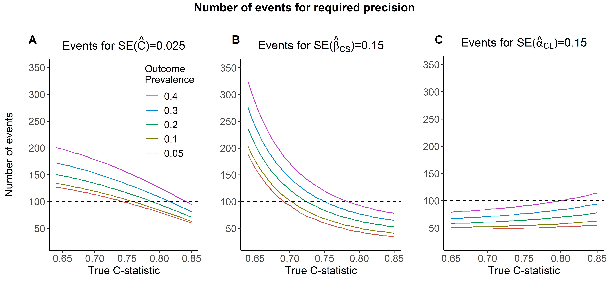

---
output:
  html_document:
    df_print: paged
  word_document: default
  pdf_document: default
---

<!-- README.md is generated from README.Rmd. Please edit that file -->

# sampsizeval

<!-- badges: start -->

<!-- badges: end -->

The purpose of **sampsizeval** is to perform sample size calculations for the validation of risk models for binary outcomes.

## Installation

<!-- You can install the released version of sampsizeval from [CRAN](https://CRAN.R-project.org) with: -->

<!-- ``` r -->

<!-- install.packages("sampsizeval") -->

<!-- ``` -->

The development version can be installed from [GitHub](https://github.com/mpavlou) with:

``` r
# install.packages("devtools")
devtools::install_github("mpavlou/sampsizeval")
```

## Example

This is an example of sample size calculations for a binary outcome presented in Section 7 of the paper[GitHub]. The anticipated C-statistic and outcome prevalence are: C=0.77 and p=0.057.

```{r example}
library(sampsizeval)
```

Sample size required to acheive a SE of C-statistic of at most 0.025

```{r}
size_c(0.057, 0.77, 0.025^2)
```

Sample size required to achieve a SE of the Calibration Slope of at most 0.15:

```{r}
size_cs(0.057, 0.77, 0.15^2)
```

Sample size required to achieve a SE of the Calibration in the Large of at most 0.15:

```{r}
size_cil(0.057, 0.77, 0.15^2)
```

<!-- For a given precision for the estimated C-statistic, calibration slope and calibration in the large, the required sample size varies depending on the anticipated values of the  C-statistic and outcome prevalence. For example, for required precisions SE(C)=0.025, SE(CS)=0.15 and SE(CiL)=0.15, the sample size varies as follows: -->

<!--  -->
